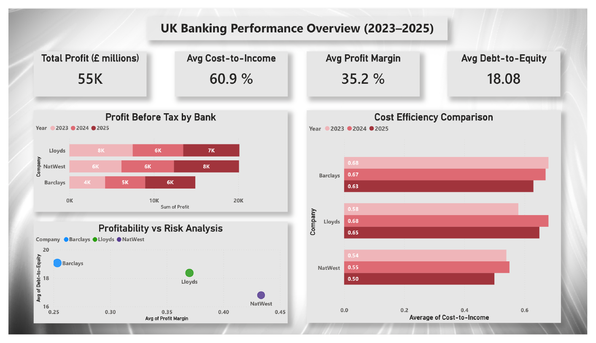
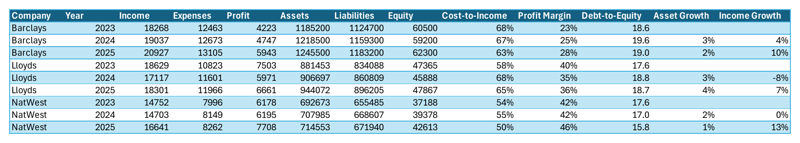

# UK Banks Financial Analysis (2023–2025)

A financial performance comparison of **Barclays, Lloyds and NatWest** across three years, combining SQL, Excel ratio analysis and a Power BI dashboard to answer one question: **which bank offers the strongest balance of profitability, efficiency, growth and risk?**

---

## Dashboard Preview

### Performance Overview


### Financial Ratios


---

## Business Problem

Headline profit alone does not show how well a bank is run. An investor or analyst needs to compare banks on **efficiency, margins, leverage and growth** together, and adjust returns for the level of risk taken.

---

## Dataset

- Nine records: 3 banks × 3 financial years (2023, 2024, 2025)
- Fields: Income, Expenses, Profit, Assets, Liabilities, Equity (**£ millions**)
- Compiled from the banks' published annual results
- Files: `bank_financial_analysis.csv`, `bank_financial_analysis.xls`

---

## Approach

**1. SQL** – created and loaded a structured table in SQLite (`01_create_and_load.sql`)

**2. Excel** – calculated the financial ratios:

| Metric | Formula |
|---|---|
| Cost-to-Income | Expenses ÷ Income |
| Profit Margin | Profit ÷ Income |
| Debt-to-Equity | Liabilities ÷ Equity |
| Asset Growth | (Assets this year − last year) ÷ last year |
| Income Growth | (Income this year − last year) ÷ last year |

**3. Power BI** – built a 5-page dashboard:

| Page | What it shows |
|---|---|
| Overview | Total profit, average cost-to-income, profit margin and debt-to-equity; profit and efficiency by bank |
| Trends | Income, profit, asset and income growth over time |
| Investment Decision | An **Investment Score** combining profitability, efficiency and growth |
| Risk & Stability | **Risk-adjusted return** (return ÷ risk level) for each bank |
| Conclusion | Best bank, most improved, best risk-return, highest profit and most efficient |

---

## Key Results

| Bank | 2025 Cost-to-Income | 2025 Profit Margin | 2025 Debt-to-Equity | Profit Margin trend |
|---|---|---|---|---|
| **NatWest** | **49.6%** | **46.3%** | **15.8** | 41.9% → 46.3% |
| Lloyds | 65.4% | 36.4% | 18.7 | 40.3% → 36.4% |
| Barclays | 62.6% | 28.4% | 19.0 | 23.1% → 28.4% |

Across all three banks: **£55.1bn** total profit, 60.9% average cost-to-income, 35.2% average profit margin and 18.08 average debt-to-equity.

---

## Key Insights

- **NatWest is the strongest overall performer** – the lowest cost-to-income, highest profit margin and highest return per unit of risk.
- **Barclays is the most improved** – the lowest score overall, but the only bank improving consistently every year (profit margin up 5.3 points), making it a long-term growth candidate.
- **Lloyds is stable but losing momentum** – still profitable, but its margin fell from 40.3% to 36.4% and income dropped 8.1% in 2024.
- Barclays carries the **highest leverage** (debt-to-equity ≈ 19) and delivers the lowest return per unit of risk.

---

## Repository Structure

```
UK-Banks-Financial-Analysis/
├── README.md
├── Banks_Financial_Analysis.pbix        Power BI dashboard
├── bank_financial_analysis.csv          Data with ratios
├── bank_financial_analysis.xls          Excel workbook
├── 01_create_and_load.sql               SQL table setup
└── 01–02 *.png                          Dashboard screenshots
```

---

## Tools & Skills

- **SQL (SQLite)** – table design and data loading
- **Excel** – financial ratio and growth calculations
- **Power BI** – KPI cards, trend visuals, scoring model and risk-return analysis
- **Finance** – cost-to-income, profit margin, leverage and growth analysis

---

## Limitations

- Small sample (three banks, three years), so results are directional rather than statistically robust
- Investment score and risk level are analytical constructs, not investment advice

---

## Author

**Mannan Hakim** – MBA | Data Analyst
[LinkedIn](https://www.linkedin.com/in/mannan-hakim-aa654a250/) · [GitHub](https://github.com/mannanhakim)
